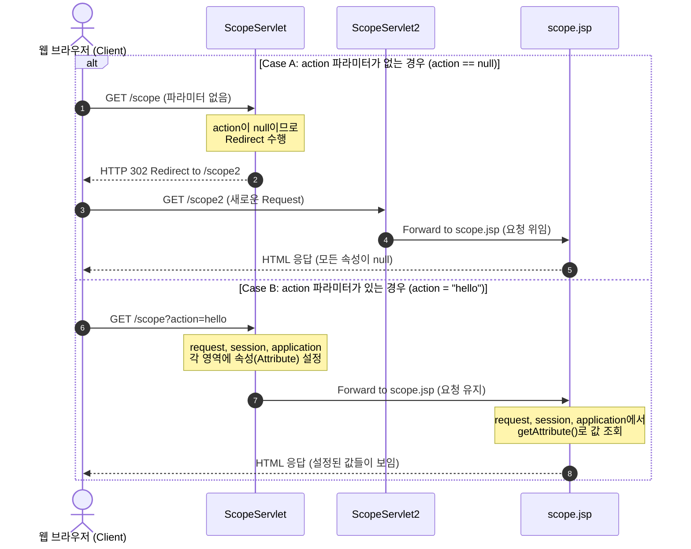

# Servlet/JSP Scope & Redirection: 03_ScopeServlet

이 문서는 [ScopeServlet.java](file:///Users/morgan/Documents/workspace/servlet/src/main/java/com/example/servlet/ScopeServlet.java), [ScopeServlet2.java](file:///Users/morgan/Documents/workspace/servlet/src/main/java/com/example/servlet/ScopeServlet2.java), 그리고 [scope.jsp](file:///Users/morgan/Documents/workspace/servlet/src/main/webapp/scope.jsp)를 바탕으로 Servlet/JSP의 4대 Scope(영역)와 포워드(Forward)/리다이렉트(Redirect)의 작동 원리를 설명합니다.

---

## 1. 초심자용 실생활 비유 💡

웹 애플리케이션에서 데이터를 저장하는 네 가지 영역(Scope)은 데이터를 **"누가, 얼마나 오래 보관하고 사용할 수 있는가"**에 따라 나뉩니다. 이를 일상생활의 비유로 쉽게 이해해 봅시다.

### ① Page Scope (페이지 영역)
*   **비유:** **"개인 책상의 임시 연습장(메모지)"**
*   **설명:** 내가 지금 내 책상에 앉아서 문제를 푸는 동안에만 낙서하고 사용하는 임시 메모지입니다. 책상에서 일어나 다른 방으로 가거나(페이지 이동), 옆 사람에게 내 책상을 양보하는 순간 이 메모지는 지워지고 버려집니다.
*   **JSP 매칭:** `pageContext` 영역. 오직 하나의 JSP 페이지 안에서만 데이터를 공유하며, 페이지가 닫히거나 다른 페이지로 흐름이 넘어가면 사라집니다.

### ② Request Scope (요청 영역)
*   **비유:** **"식당의 주문서(주문표)"**
*   **설명:** 손님이 음식을 주문하면 직원이 주문서에 주문 내역을 적어 주방에 전달(Forward)합니다. 주방에서는 주문서를 보고 음식을 만들어 손님 테이블로 서빙(Response)합니다. 서빙이 완료되면 그 주문서는 쓰레기통으로 들어갑니다.
    *   **Forward(포워드):** 식당 직원이 주문서를 주방 요리사에게 직접 넘겨주는 것과 같습니다. 주문서(Request)가 그대로 유지됩니다.
    *   **Redirect(리다이렉트):** 손님에게 "죄송하지만 옆 매장(새 주소)으로 가셔서 다시 주문해 주세요"라고 안내하는 것입니다. 손님은 완전히 새로운 주문서(New Request)를 새로 작성해야 합니다.
*   **Servlet/JSP 매칭:** [HttpServletRequest](file:///Users/morgan/Documents/workspace/servlet/src/main/java/com/example/servlet/ScopeServlet.java) 객체. 클라이언트의 한 번의 요청에 대해 응답할 때까지만 유지되는 영역입니다.

### ③ Session Scope (세션 영역)
*   **비유:** **"대형마트의 개인 쇼핑카트"**
*   **설명:** 마트에 들어설 때 카트 하나를 배정받습니다. 마트 안의 식품 코너, 가전 코너를 돌아다니며 물건을 담아도 내 카트는 계속 유지됩니다. 쇼핑을 마치고 마트를 나가거나(로그아웃/브라우저 종료), 오랫동안 카트를 방치하면(세션 만료) 카트는 비워지고 반납됩니다.
    *   이때 마트는 여러 손님의 카트를 구분하기 위해 **"카트 열쇠(Session ID)"**를 손님에게 쥐여주는데, 이것이 브라우저 쿠키에 저장되는 `JSESSIONID`입니다.
*   **Servlet/JSP 매칭:** [HttpSession](file:///Users/morgan/Documents/workspace/servlet/src/main/java/com/example/servlet/ScopeServlet.java) 객체. 웹 브라우저당 하나씩 생성되며, 웹 브라우저를 닫거나 세션이 만료될 때까지 데이터가 유지됩니다.

### ④ Application Scope (어플리케이션 영역)
*   **비유:** **"대형마트의 공용 게시판 또는 엘리베이터"**
*   **설명:** 마트 입구에 있는 공용 게시판은 마트가 문을 열 때 설치되어, 마트가 폐점할 때까지 유지됩니다. 마트를 이용하는 모든 손님(All Clients)과 모든 직원(All Servlets/JSPs)이 이 게시판의 정보를 공유해서 볼 수 있고 글을 쓸 수도 있습니다.
*   **Servlet/JSP 매칭:** [ServletContext](file:///Users/morgan/Documents/workspace/servlet/src/main/java/com/example/servlet/ScopeServlet.java) 객체. 웹 애플리케이션이 톰캣 등의 서버에 의해 시작되어 종료될 때까지 유지되는 영역으로, 애플리케이션 내의 모든 사용자와 서블릿이 공유합니다.

---

## 2. 중급자용 실제 동작 원리와 의존성, 문법 특성 🛠️

### ① 동작 방식 및 데이터 흐름 상세 분석

현재 프로젝트의 서블릿 코드를 바탕으로 일어나는 실제 프로세스는 다음과 같습니다.

#### A. `ScopeServlet.java`에서 파라미터가 없을 때 (`action == null`)
*   `resp.sendRedirect("/scope2");` 호출 시:
    1.  서버는 클라이언트(브라우저)에게 **HTTP Status Code 302**와 헤더 `Location: /scope2`를 보냅니다.
    2.  브라우저는 이 응답을 받고 즉시 주소창을 `/scope2`로 변경하여 **새로운 HTTP GET 요청**을 보냅니다.
    3.  이 과정에서 첫 번째 요청에 포함되었던 `HttpServletRequest` 객체는 소멸하고, 완전히 새로운 `HttpServletRequest` 객체가 생성됩니다.
    4.  따라서 `/scope2`를 처리하는 [ScopeServlet2](file:///Users/morgan/Documents/workspace/servlet/src/main/java/com/example/servlet/ScopeServlet2.java)와 위임받은 [scope.jsp](file:///Users/morgan/Documents/workspace/servlet/src/main/webapp/scope.jsp)에서는 이전 요청에 탑재하려 했던 request 영역의 속성들을 참조할 수 없습니다.

#### B. `ScopeServlet.java`에서 파라미터가 존재할 때 (예: `?action=test`)
*   `req.getRequestDispatcher("scope.jsp").forward(req, resp);` 호출 시:
    1.  서버 내부적으로 제어권을 [scope.jsp](file:///Users/morgan/Documents/workspace/servlet/src/main/webapp/scope.jsp)로 넘깁니다. (클라이언트는 이 포워딩이 일어났는지 모릅니다. 브라우저 주소창은 그대로 `/scope`로 남아 있습니다.)
    2.  이때 동일한 `HttpServletRequest`와 `HttpServletResponse` 객체가 그대로 전달되므로, 서블릿에서 설정한 `req.setAttribute("action", action.toUpperCase())` 값을 JSP에서 `request.getAttribute("action")`으로 그대로 꺼내 쓸 수 있습니다.

### ② 의존성 및 서블릿 API 주요 문법 특성

#### A. 패키지 및 라이브러리 의존성
*   Jakarta EE 9 이상 (톰캣 10 이상) 기준, 기존 `javax.servlet` 대신 **`jakarta.servlet`** 패키지를 의존합니다.
    *   `jakarta.servlet.http.HttpServletRequest`
    *   `jakarta.servlet.http.HttpSession`
    *   `jakarta.servlet.ServletContext`

#### B. Scope별 참조 및 설정 문법
Java 서블릿 코드와 JSP 스크립틀릿/EL 표현식 매핑은 다음과 같습니다.

| 영역 (Scope) | Java Servlet에서의 접근 방법 | JSP에서의 기본 내장 객체 | 생명주기 (Lifecycle) |
| :--- | :--- | :--- | :--- |
| **Page** | (Servlet에는 없음) | `pageContext` | JSP 페이지 내부 실행 시까지 |
| **Request** | `req.setAttribute("key", value)` | `request` | 하나의 클라이언트 요청이 유지될 때까지 (Forward 포함) |
| **Session** | `req.getSession().setAttribute("key", value)` | `session` | 세션이 활성화되어 있는 동안 (브라우저 종료 또는 세션 타임아웃) |
| **Application** | `req.getServletContext().setAttribute("key", value)` | `application` | 웹 애플리케이션이 구동되는 전체 기간 |

#### C. Parameter vs Attribute
*   **Parameter (`getParameter(String name)`)**:
    *   클라이언트가 서버로 전송하는 데이터(Query String, POST Form 데이터 등)를 가져옵니다.
    *   항상 **`String`** 타입으로 리턴됩니다.
    *   `request.setParameter()` 메서드는 존재하지 않으며, 클라이언트의 요청 시점에 값이 고정됩니다.
*   **Attribute (`getAttribute(String name)`)**:
    *   컨테이너 영역(Request, Session, Application)에 서버 측 자바 객체를 key-value 형태로 저장하고 꺼내옵니다.
    *   모든 자바 **`Object`** 타입을 저장할 수 있습니다.
    *   `setAttribute(String name, Object value)` 메서드를 통해 개발자가 자유롭게 서버에서 설정할 수 있습니다.

#### D. 동시성(Thread-Safety) 이슈
*   **Request Scope**: 각 요청마다 독립적인 스레드와 `HttpServletRequest` 인스턴스가 할당되므로 Thread-safe합니다.
*   **Session Scope**: 한 사용자가 여러 브라우저 탭을 열고 동시에 요청을 보내면 동일한 `HttpSession`에 접근하게 되므로 동시성 문제가 생길 수 있습니다. (동기화 고려 필요)
*   **Application Scope**: 모든 사용자의 요청 스레드가 단 하나의 `ServletContext` 인스턴스를 공유하므로, 이곳의 가변 상태(Mutable state)를 수정할 때는 매우 엄격하게 동시성을 제어(`synchronized` 또는 thread-safe한 자료구조 사용)해야 합니다.

---

## 3. 면접 준비를 위한 예상 Q&A 💬

### **Q1. Servlet/JSP의 4대 영역(Scope)에 대해 설명하고 각 영역의 범위와 특징을 비교해 주세요.**
> **답변:**
> Servlet/JSP에는 데이터를 공유할 수 있는 4가지 영역이 있습니다.
> 1. **Page 영역 (`pageContext`):** 해당 JSP 페이지 내에서만 사용 가능하며 페이지를 벗어나면 소멸합니다.
> 2. **Request 영역 (`request`):** 클라이언트의 요청 한 번과 그에 따른 응답이 완료될 때까지 유효합니다. Forward로 다른 서블릿/JSP로 흐름이 넘어가도 동일한 Request를 공유하므로 유효합니다.
> 3. **Session 영역 (`session`):** 동일 브라우저 세션 내에서 유지됩니다. 로그아웃하거나 브라우저를 종료(혹은 세션 타임아웃)하기 전까지는 여러 요청에 걸쳐 유지됩니다.
> 4. **Application 영역 (`application`):** 웹 애플리케이션 전체에서 공유하며, 서버가 시작되어 종료될 때까지 생명주기가 유지됩니다. 모든 사용자와 모든 서블릿/JSP가 값을 공유합니다.

---

### **Q2. Forward 방식과 Redirect 방식의 결정적인 차이점을 동작 원리와 Request Scope 관점에서 설명해 주세요.**
> **답변:**
> *   **Forward**는 서버 내부에서 일어나는 페이지 전환입니다. 클라이언트는 포워드가 발생하는지 알지 못하며 브라우저 주소창도 유지됩니다. 같은 `HttpServletRequest` 객체를 넘겨주기 때문에 **Request Scope에 담은 데이터를 그대로 유지**하여 다음 페이지에서 사용할 수 있습니다.
> *   **Redirect**는 서버가 클라이언트에게 다른 URL로 다시 요청하라는 응답(HTTP Status 302)을 보내는 것입니다. 브라우저는 서버의 지시에 따라 완전히 새로운 HTTP GET 요청을 보내므로 브라우저 주소창이 변경됩니다. 이 과정에서 새로운 요청 객체가 생성되어 **이전 Request Scope에 설정된 속성은 전부 소멸**합니다.

---

### **Q3. HttpServletRequest에서 `getParameter()`와 `getAttribute()`의 차이점은 무엇인가요?**
> **답변:**
> *   **`getParameter()`**는 클라이언트가 웹 브라우저를 통해 전달한 값(쿼리 스트링 파라미터, HTTP Body의 Form 값 등)을 읽어오는 메서드로, 반환 타입은 항상 `String`입니다.
> *   **`getAttribute()`**는 컨트롤러(서블릿) 등 서버 내부 로직에서 `request.setAttribute()`를 통해 임의로 저장한 속성(자바 객체)을 꺼내오는 메서드이며, 반환 타입은 `Object`입니다. (원하는 타입으로 캐스팅이 필요합니다.)

---

### **Q4. 세션(Session)과 쿠키(Cookie)의 관계 및 동작 방식에 대해 설명해 주세요.**
> **답변:**
> HTTP 프로토콜은 상태를 유지하지 않는(Stateless) 특성이 있습니다. 이를 극복하기 위해 세션과 쿠키를 연동해 사용합니다.
> 1. 사용자가 처음 접속하면 서버는 고유한 세션 ID(`JSESSIONID`)를 생성하여 메모리에 저장하고, 이를 HTTP 응답 헤더에 `Set-Cookie: JSESSIONID=값` 형태로 클라이언트에 보냅니다.
> 2. 브라우저는 이 쿠키를 저장해 두었다가, 이후 동일 서버로 요청을 보낼 때마다 요청 헤더(`Cookie: JSESSIONID=값`)에 실어 보냅니다.
> 3. 서버는 요청 헤더의 `JSESSIONID`를 보고 "아, 이 요청은 아까 그 사용자의 요청이구나"를 식별하고 해당하는 `HttpSession` 인스턴스를 찾아 연결해 줍니다.
> 즉, **세션은 실제 데이터를 안전하게 서버에 저장**하고, **쿠키는 해당 데이터에 접근하기 위한 식별자(Key)** 역할을 브라우저에 남겨두는 방식입니다.

---

### **Q5. 여러 사용자가 동시에 접속하는 웹 프로그램에서 Application Scope(`ServletContext`)나 Session Scope(`HttpSession`)에 값을 직접 수정(Write)할 때 주의해야 할 점은 무엇인가요?**
> **답변:**
> *   **동시성(Thread-Safety) 문제**에 유의해야 합니다. 서블릿 컨테이너(톰캣 등)는 클라이언트의 각 요청을 처리하기 위해 스레드를 띄웁니다.
> *   `ServletContext`는 애플리케이션 전체에 딱 하나만 존재하여 모든 스레드가 공유하므로 여러 스레드가 동시에 쓰기 작업을 수행하면 데이터 오염이 발생할 수 있습니다.
> *   `HttpSession` 역시 하나의 세션 객체를 한 사용자가 여러 탭을 열어서 동시에 다중 요청을 발송하는 경우 동시성 경쟁 상태에 놓일 수 있습니다.
> *   따라서 이 영역들의 데이터를 가변(Mutable) 객체로 다룰 때는 공유 자원에 대해 적절한 동기화(`synchronized`) 처리를 해주거나, `ConcurrentHashMap`과 같은 Thread-safe 컬렉션을 사용하는 등 안전한 설계가 수반되어야 합니다.
