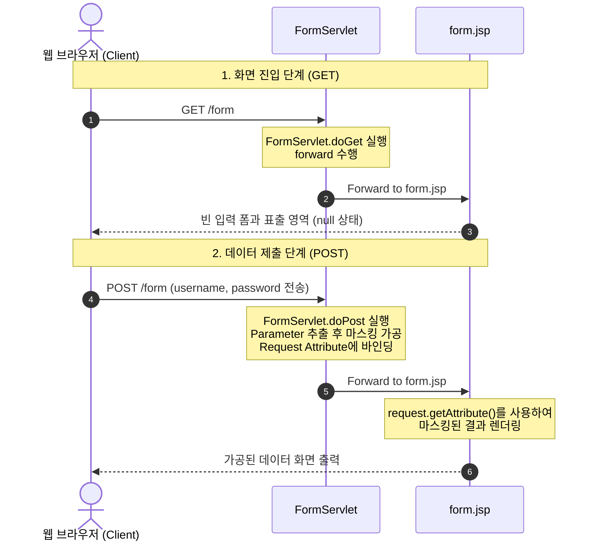

# HTTP Form Handling: 04_FormServlet

이 문서는 [FormServlet.java](file:///Users/morgan/Documents/workspace/servlet/src/main/java/com/example/servlet/FormServlet.java)와 [form.jsp](file:///Users/morgan/Documents/workspace/servlet/src/main/webapp/form.jsp)를 바탕으로 HTTP GET/POST 요청의 처리 방식과 웹 폼(Form) 데이터를 가공하고 사용자에게 전달하는 원리를 설명합니다.

---

## 1. 초심자용 실생활 비유 💡

웹 브라우저와 서버가 데이터를 주고받는 방식 중 대표적인 두 가지인 **GET**과 **POST**, 그리고 데이터를 처리하는 **Servlet**과 **JSP**의 관계를 실생활에 비유해 봅시다.

### ① GET 요청
*   **비유:** **"도서관 사서에게 특정 도서를 청구하거나 맛집 메뉴판을 달라고 요청하기"**
*   **설명:** 단순히 정보를 "조회(가져오기)"할 때 사용합니다. 메뉴판을 칠판에 적어 모두가 볼 수 있게 하는 것처럼, 내가 찾는 정보(예: 검색어, 페이지 번호)를 주소창(`?key=value`)에 그대로 드러내서 전송합니다. 누구나 주소를 복사해서 다른 사람에게 공유할 수 있는 열린 형태입니다.

### ② POST 요청
*   **비유:** **"비밀 서류나 입사 지원서를 대외비 봉투에 넣어 우체통에 제출하기"**
*   **설명:** 새로운 데이터를 서버에 저장하거나 회원가입, 로그인처럼 개인정보나 민감한 데이터를 전송할 때 사용합니다. 정보가 주소창에 보이지 않도록 편지 봉투 안(HTTP Request Body)에 밀봉하여 안전하게 보냅니다. 다른 사람에게 이 주소를 복사해 줘도 안의 편지 내용은 전달되지 않습니다.

### ③ Servlet과 JSP의 분업
*   **JSP (form.jsp):** **"손님이 작성할 빈 설문지 양식과 결과를 보여주는 게시판"**
*   **Servlet (FormServlet):** **"설문지를 받아 내용을 검토하고 마스킹(예: 홍길동 -> 홍길**) 처리하여 게시판에 붙여주는 사무원"**
    *   JSP가 화면을 예쁘게 그리고 입력을 받는 역할이라면, 서블릿은 사용자가 보낸 데이터를 검증하고 가공하는 복잡한 사무 업무(비즈니스 로직)를 전담합니다.

---

## 2. 중급자용 실제 동작 원리와 의존성, 문법 특성 🛠️

### ① 동작 방식 및 데이터 흐름 상세 분석

현재 프로젝트의 서블릿 코드를 바탕으로 일어나는 실제 프로세스는 다음과 같습니다.



#### A. GET 요청 진입 (`FormServlet.doGet`)
*   사용자가 `/form` URL로 접속하면 [FormServlet.java](file:///Users/morgan/Documents/workspace/servlet/src/main/java/com/example/servlet/FormServlet.java)의 [doGet](file:///Users/morgan/Documents/workspace/servlet/src/main/java/com/example/servlet/FormServlet.java#L13-L19)이 호출됩니다.
*   `doGet` 내부에서는 `req.getRequestDispatcher("form.jsp").forward(req, resp);`를 통해 화면을 사용자에게 돌려줍니다. 
*   **목적:** 사용자가 직접 `.jsp` 파일 경로에 접근하는 것을 막고, 서블릿 가상 경로(`/form`)를 통해 화면을 통제합니다.

#### B. POST 요청 처리 (`FormServlet.doPost`)
*   [form.jsp](file:///Users/morgan/Documents/workspace/servlet/src/main/webapp/form.jsp)에서 `<form action="/form" method="post">` 형식으로 제출하면 [doPost](file:///Users/morgan/Documents/workspace/servlet/src/main/java/com/example/servlet/FormServlet.java#L21-L37) 메소드가 호출됩니다.
*   클라이언트가 보낸 데이터는 `req.getParameter("name")`를 통해 문자열로 추출됩니다.
*   서블릿은 자바의 `String` API를 사용해 데이터를 가공(마스킹)한 뒤 `req.setAttribute("name", value)`를 통해 요청 객체에 속성으로 바인딩합니다.
*   그 후 다시 `form.jsp`로 forward하여 마스킹된 값을 화면에 출력합니다.

> [!WARNING]
> **PRG(Post-Redirect-Get) 패턴의 부재와 F5 새로고침 문제**
> * 현재 `doPost` 코드는 가공된 데이터를 요청 객체(`req`)에 담아 `form.jsp`로 직접 **Forward**합니다.
> * 이 경우 클라이언트 웹 브라우저의 최종 요청 상태는 여전히 **POST /form**입니다.
> * 이 상태에서 사용자가 브라우저 **새로고침(F5)**을 누르면, 브라우저는 이전에 제출했던 회원가입/비밀번호 데이터(POST)를 **중복 전송**하려고 시도하여 원치 않는 중복 처리나 경고창이 발생하게 됩니다.
> * 실무에서는 이를 방지하기 위해 데이터를 DB 등에 저장한 후 `resp.sendRedirect("결과페이지")`를 호출하여 최종 브라우저 상태를 GET 요청으로 바꾸는 **PRG 패턴**을 반드시 적용해야 합니다.

### ② 문법 특성 및 코드 분석

#### A. Java 11 `String.repeat(int count)`를 활용한 마스킹
*   [FormServlet.java](file:///Users/morgan/Documents/workspace/servlet/src/main/java/com/example/servlet/FormServlet.java)의 30~35 라인을 보면 다음과 같이 마스킹을 수행합니다.
    ```java
    req.setAttribute("username",
        req.getParameter("username").substring(0, 3) + "*".repeat(req.getParameter("username").length() - 3)
    );
    ```
*   `substring(0, 3)`을 통해 첫 3글자를 추출하고, 전체 길이에서 3을 뺀 만큼 `*`를 반복(`repeat`)하여 이어 붙입니다.
*   **주의점 (예외 가능성):** 입력받은 `username`이나 `password`가 3글자보다 적을 경우, `substring(0, 3)` 호출 시 `IndexOutOfBoundsException` 에러가 발생하게 됩니다. 따라서 서비스 레이어에서는 사전에 입력 길이에 대한 밸리데이션(유효성 검사)이 필수적입니다.

#### B. Parameter와 Attribute의 역할 분리
*   **Parameter:** 클라이언트에서 넘어온 가공되지 않은 순수 입력값 (`req.getParameter("username")`).
*   **Attribute:** 서버 측에서 비즈니스 로직(마스킹 등)을 수행한 뒤 화면에 출력하기 위해 가공한 값 (`req.getAttribute("username")`).
*   [form.jsp](file:///Users/morgan/Documents/workspace/servlet/src/main/webapp/form.jsp)에서는 원래 사용자가 입력했던 원본 값을 출력하는 대신, 서블릿이 보안 처리를 완료하고 전송해 준 `getAttribute()` 값을 출력하여 MVC 아키텍처의 책임 분리를 충실히 구현하고 있습니다.

---

## 3. 면접 준비를 위한 예상 Q&A 💬

### **Q1. HTTP GET 메소드와 POST 메소드의 결정적인 차이점에 대해 설명해 주세요.**
> **답변:**
> *   **GET**은 서버로부터 데이터를 조회할 때 주로 사용되는 멱등(Idempotent) 메소드입니다. 데이터가 URL의 쿼리 스트링 형태로 노출되어 전송되므로 길이 제한이 있고 보안에 취약하지만, 캐싱 및 북마크가 가능하다는 장점이 있습니다.
> *   **POST**는 서버의 데이터를 생성하거나 변경할 때 사용되는 비멱등(Non-idempotent) 메소드입니다. 데이터가 HTTP 패킷의 Request Body에 포함되어 전달되므로 겉으로 노출되지 않아 보안상 더 유리하며, 대량의 데이터나 바이너리 파일 전송에 사용됩니다.

---

### **Q2. Servlet에서 POST 처리 후 JSP 화면으로 포워드(Forward)할 때 발생할 수 있는 '새로고침 문제'와 그 해결책은 무엇인가요?**
> **답변:**
> *   POST 요청을 받아 비즈니스 로직을 수행한 뒤 화면으로 바로 포워딩하게 되면, 사용자가 브라우저에서 새로고침(F5)을 누를 때 브라우저가 직전의 POST 요청을 재전송하게 됩니다. 이로 인해 데이터 중복 삽입 등의 원치 않는 결과를 초래할 수 있습니다.
> *   이를 해결하기 위해 **PRG(Post-Redirect-Get) 패턴**을 사용합니다. POST 요청을 처리한 후, 포워드가 아닌 리다이렉트(Redirect)를 수행하여 클라이언트의 최종 상태를 GET 요청으로 유도함으로써 새로고침 시 단순 조회(GET) 요청만 발생하게 만듭니다.

---

### **Q3. FormServlet의 마스킹 처리 부분(`substring(0, 3)`)에서 발생할 수 있는 문제점과 방어적 코드 작성 방안에 대해 설명해 주세요.**
> **답변:**
> *   사용자가 입력한 문자열의 길이가 3보다 작을 경우 `StringIndexOutOfBoundsException` 예외가 발생하여 서버 에러 페이지(HTTP 500)가 노출될 수 있습니다.
> *   이를 막기 위해, 마스킹 처리 전에 문자열의 길이가 3 이상인지 사전 유효성 검사(Validation)를 하거나, 아래 예시와 같이 안전하게 처리하는 방어적 로직이 작성되어야 합니다.
>     ```java
>     String username = req.getParameter("username");
>     if (username != null && username.length() >= 3) {
>         req.setAttribute("username", username.substring(0, 3) + "*".repeat(username.length() - 3));
>     } else {
>         req.setAttribute("username", username); // 유효하지 않거나 너무 짧은 경우에 대한 대체값
>     }
>     ```

---

### **Q4. JSP 파일에 직접 주소를 치고 들어가는 것과 서블릿 경로를 거쳐서 포워딩되는 것의 차이는 무엇인가요?**
> **답변:**
> *   JSP 파일에 직접 접근할 경우 컨트롤러 역할을 하는 서블릿의 사전 처리(데이터 로딩, 보안 필터링, 유효성 검증 등)가 누락되어 비정상적이거나 완전하지 못한 화면이 렌더링될 수 있고, 내부 파일 구조가 노출될 염려가 있습니다.
> *   따라서 서블릿을 통해 가상 경로로 요청을 먼저 받아 필요한 사전 처리를 거친 후, `forward`를 통해 실제 뷰(JSP) 파일로 흐름을 양도하는 것이 캡슐화와 MVC 아키텍처 설계에 적합합니다.

---

### **Q5. HTML `<form>` 태그의 `action` 속성 작성 시 상대 경로와 절대 경로, 그리고 `contextPath` 사용 이유에 대해 설명해 주세요.**
> **답변:**
> *   경로를 지정할 때 절대 경로인 `/form`을 적으면 WAS에 배포된 애플리케이션의 루트 경로를 기준으로 매핑됩니다.
> *   하지만 실제 운영 서버 환경에서는 서비스가 `/` 루트가 아닌 `/app` 같은 특정 서브 디렉토리(Context Path) 이하에 배포되는 경우가 많습니다. 이 경우 절대 경로가 맞지 않아 404 에러가 나게 됩니다.
> *   이를 해결하기 위해 JSP에서는 `${pageContext.request.contextPath}/form`과 같이 dynamic하게 컨텍스트 패스를 붙여주거나, 상대 경로를 사용하여 컨텍스트 패스 변화에 유연하게 대응하도록 설계해야 합니다.
